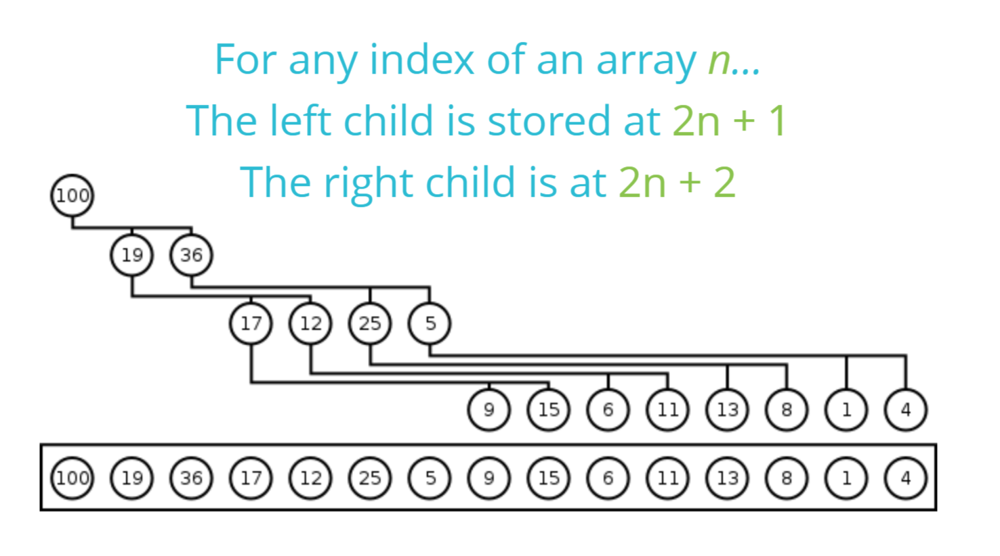
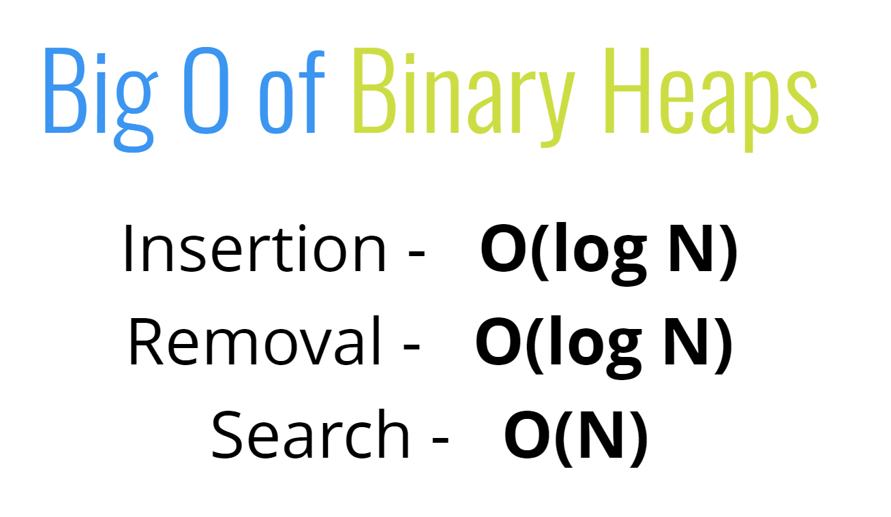

# 이진 힙 Binary Heap

목차

1. [힙이란 무엇인가](#힙이란-무엇인가)
2. [힙의 정렬](#힙의-정렬)

# 힙이란 무엇인가

트리에는 종류가 굉장히 많고 각자 정해진 규칙이 있는데 힙도 그중 하나이다. 
여기서 다룰 힙은 이진 힙이고 '이진' 이란 이름이 붙은 만큼 자식 노드의 최대 갯수는 2개로 정해져 있다. 

힙은 최소 힙, 최대 힙이라는 종류로 나뉘어져 있다. 
최대 힙은 부모 노드가 항상 자식 노드보다 커야하고 최소 힙은 부모 노드는 자식 노드보다 작아야 한다. 그리고 힙은 최적의 메모리를 유지하기 위해 다음 레벨로 내려가기 전에 left와 right 노드를 전부 채운다. 만약 자식이 한쪽밖에 없다면 왼쪽 노드부터 채운다.
형제 노드끼리는 높낮이의 관계가 아예 없으므로 착각하지 않도록 한다.

힙은 우선순위 큐를 만들기 위해 자주 사용된다.
또한 그래프를 순회할 때도 사용된다.

# 이진 힙의 정렬

힙은 배열로 나타낼 수 있다. 자식 노드를 다 채운다는 규칙에서 부모와 자식관계를 나타내는 수학 공식이 있기 때문이다. 
부모 노드에서 자식 노드를 찾기 위해서는 부모 노드 인덱스에 2를 곱한 후 1을 더하면 왼쪽 2를 더하면 오른쪽 자식이다. 
자식 노드에서 부모 노드를 찾기 위해서는 자식 노드 인덱스에 1을 뺀 뒤 2로 나눈다. 소숫점은 내린다.

# 이진 힙의 Big O

이진 힙은 값을 정렬하는데에 O(log n) 밖에 걸리지 않기 때문에 삽입과 제거에 특화 돼있다고 할 수 있다.
하지만 탐색은 다르다. 이진 힙은 형제 간의 상하관계가 없다. 부모보다 작은 값이 왼쪽에 있을 수도 오른쪽에 있을 수도 있다. 때문에 잠재적으로 모든 노드를 돌아야하므로 O(n)의 시간복잡도를 가진다.
따라서 탐색이 중요할 경우에는 이진 탐색 트리를 사용하는게 낫다.
