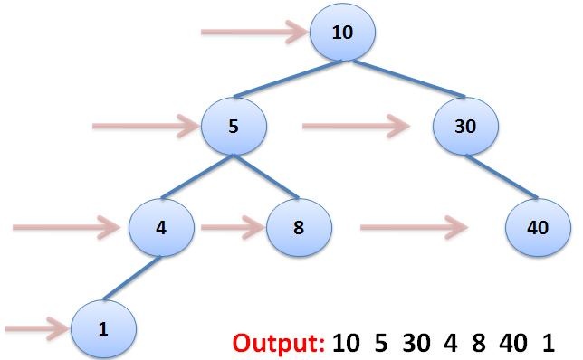
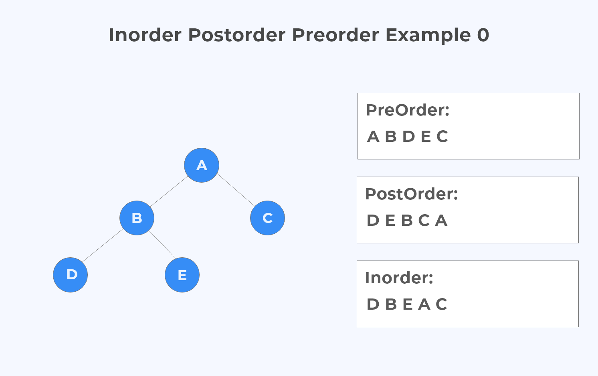

# 트리 순회

[예제에서 사용하는 이진 탐색 트리 코드](./BinarySearch/BST.js)

목차

1. [BFS (너비 우선 탐색)](#bfs)
2. [DFS (깊이 우선 탐색)](#dfs)
3. [DFS, BFS 무엇을 사용해야 하는가?](#dfs-bfs-무엇을-사용해야-하는가)
4. [DFS의 정위,후위,전위 순회 중 무엇을 사용해야 하는가?](#dfs의-정위후위전위-순회-무엇을-사용해야-하는가)

## BFS

```js
BFS() {
  var node = this.root,
      data = [],
      queue = [];
  queue.push(node)
  while(queue.length){
     node = queue.shift();
     data.push(node.value);
     if(node.left) queue.push(node.left);
     if(node.right) queue.push(node.right);
  }
  return data;
}
```

<br>
루트에서부터 한 단계씩 내려오면서 해당 단계의 노드를 탐색하는 방법<br>
위 예제에서는 이진 탐색 트리로 예를 들어서 왼쪽과 오른쪽만 탐색하지만, 삼진이면 왼,중,오, 그냥 트리라면 자식 전부를 배열로 담아도 될 것이다.

## DFS

```js
DFSPreOrder(){ // 전위 순회 (Root, Left, Right)
  var data = [];
  function traverse(node) {
    data.push(node.value);
    if(node.left) traverse(node.left);
    if(node.right) traverse(node.right);
  }
  traverse(this.root);
  return data;
}

DFSPostOrder() { // 후위 순회 (Left, Right, Root)
  var data = [];
  function traverse(node) {
    if (node.left) traverse(node.left);
    if (node.right) traverse(node.right);
    data.push(node.value);
  }
  traverse(this.root);
  return data;
}

DFSInOrder() { // 정위 순회 (Left, Root, Right)
  var data = [];
  function traverse(node) {
    if (node.left) traverse(node.left);
    data.push(node.value);
    if (node.right) traverse(node.right);
  }
  traverse(this.root);
  return data;
}
```

<br>
DFS에서는 이름 그대로 리프(Leaf)까지 일단 내려간 다음 위로 올라오면서 탐색하는 기법이다.
세가지 순회 방법이 있는데 루트부터 탐색하면서 내려갈지, 왼쪽을 다 탐색한 뒤 루트를 거친다음에 오른쪽을 탐색할지, 오른쪽 노드를 다 거치고 루트를 마지막으로 탐색할지로 나뉜다.

## DFS, BFS 무엇을 사용해야 하는가?

DFS, BFS 모두 모든 노드를 한번씩 방문해야하니 시간 복잡도는 같다. 하지만 공간복잡도는 다르다.
BFS는 Queue에 수평의 모든 노드를 넣는다. 만약 좌우로 넓게 펼쳐진 트리가 있다면 그 모든 데이터를 큐에 집어넣어야 할 것이다. 따라서 이 경우에는 DFS가 메모리 측면에서 더 나을 것이다.<br>
하지만 한 쪽으로 치우쳐져 있어서 밑으로 쭉 뻗어있는 트리라면 DFS는 상위 레벨에 있는 노드를 전부 메모리에 저장해놓기 때문에 이 경우에는 BFS가 더 낫다고 본다.

## DFS의 정위,후위,전위 순회 무엇을 사용해야 하는가?

딱히 무엇이 더 뛰어나다 하는 것은 없다. 어떤 순서로 할지 바꾸는 것이 어려운 것도 아니기 때문에 원하는 탐색방법을 쓰면 된다.<br>
트리에 따라 다르겠지만 이진 탐색 트리의 경우에는 노드의 값이 정렬돼있기 때문에 정렬된 순서로 탐색하고자 한다면 정위 순회로 탐색하면 좋다.<br>
전위와 후위 순회는 Root의 값을 바로 찾을 수 있지만 정위 순회 같은 경우에는 Root의 값이 무엇인지 알기 어렵다.
